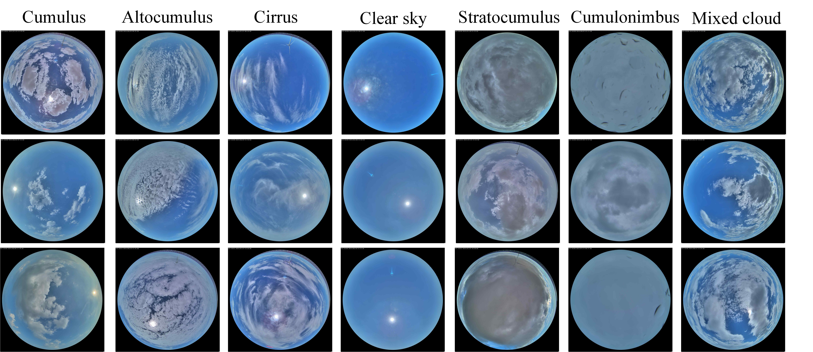

# Dataset:NCEPU-GRSCD (Ground-based Cloud Dataset)

## 1.Dataset Overview

The **NCEPU-GRSCD** is a specialized ground-based cloud image dataset collected and curated by North China Electric Power University. This dataset is designed to support research in automated cloud classification, meteorological monitoring, and ultra-short-term photovoltaic power prediction.

## 2.Data Acquisition

**Locations**:Data were collected from All-sky imagers located at North China Electric Power University in Beijing and Ulanqab, Inner Mongolia, China.

**Equipment**:All-sky imagers equipped with fish-eye lenses.

**Image Specifications**: 1920×1920 resolution, RGB three-channel images

**Sampling Rate**: The minimum time interval between consecutive captures is 30 seconds.

**Time Span**: Observations cover the period from 2023 to 2025.

## 3.Classification Standards

The dataset follows the World Meteorological Organization (WMO) cloud genera standards. It contains 7 distinct categories with a balanced distribution:

| **Cloud Genera** | **Abbreviation** | **Training Set** | **Test Set** | **Total** |
| ---------------- | ---------------- | ---------------- | ------------ | --------- |
| Cumulus          | Cu               | 1500             | 300          | 1800      |
| Altocumulus      | Ac               | 1500             | 300          | 1800      |
| Cirrus           | Ci               | 1500             | 300          | 1800      |
| Clear sky        | Cl               | 1500             | 300          | 1800      |
| Stratocumulus    | Sc               | 1500             | 300          | 1800      |
| Cumulonimbus     | Cb               | 1500             | 300          | 1800      |
| Mixed Cloud      | Mi               | 1500             | 300          | 1800      |
| **Total**        | -                | **10500**        | **2100**     | **12600** |

## 4.Data Access and Acquisition

### 4.1 Direct Download

The **NCEPU-GRSCD** dataset (including raw RGB images and processed Optical Flow maps) is hosted on Google Drive. You can access and download the full dataset via the link below:

Google Drive Link:  [NCEPU-GRSCD Dataset](https://drive.google.com/drive/folders/1rTxVDREpT_1Wws0FEVmdzihim04nyNMC?usp=drive_link)

### 4.2 Repository Structure after Extraction

To ensure the provided training and evaluation scripts work correctly, please organize the downloaded files as follows:

ncepu-grscd/
├── data/
│   ├── train/              # Training Set (10,500 images) 
│   │   ├── cumulus/        # 1,500 images 
│   │   ├── altocumulus/    # 1,500 images 
│   │   ├── cirrus/         # 1,500 images 
│   │   ├── clearsky/       # 1,500 images 
│   │   ├── stratocumulus/  # 1,500 images 
│   │   ├── cumulonimbus/   # 1,500 images 
│   │   └── mixed/          # 1,500 images 
│   └── test/               # Test Set (2,100 images) 
│       ├── cumulus/        # 300 images 
│       ├── altocumulus/    # 300 images 
│       ├── cirrus/         # 300 images 
│       ├── clearsky/       # 300 images 
│       ├── stratocumulus/  # 300 images 
│       ├── cumulonimbus/   # 300 images 
│       └── mixed/          # 300 images

### 

